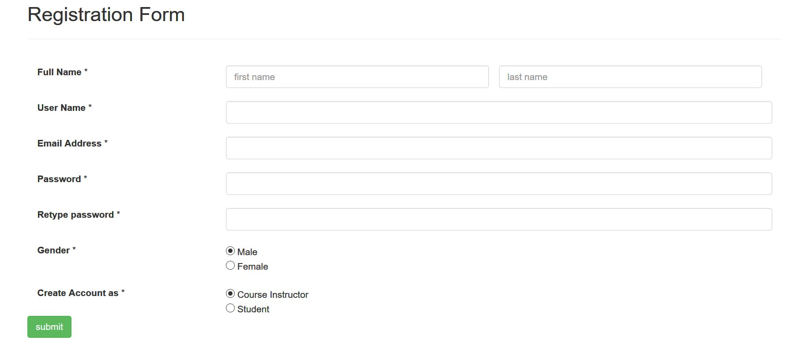
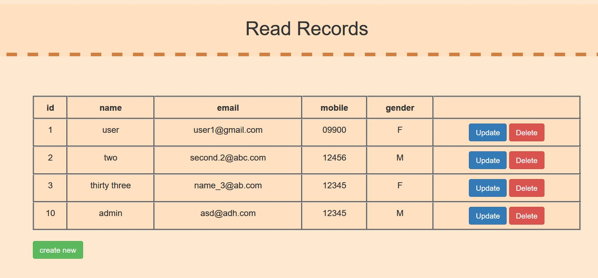

# Web-Labs-CRUD
2 lab tasks with diffenent crud operations on forms

1-> register.php,register db and reg.css 

2-> add, read, db, update, crud.css, bootstrap.css

3-> lab folder: 
images db to upload images and check its size and extension

4-> terminal 
files for the final exam crud operations

5-> php folder 
contains php practice on OOP php
